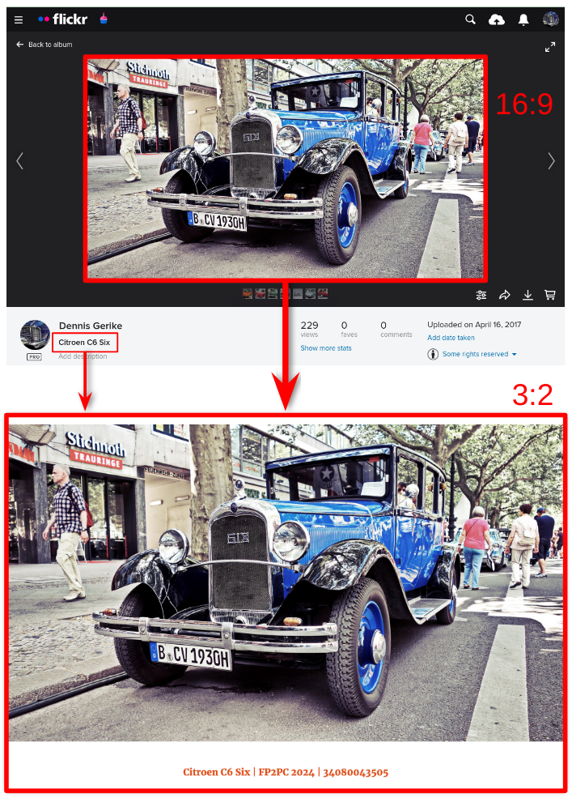

# Flickr photos to postcard converter

This tool allows you to convert and adjust your Flickr photos, so you can easily print them onto postcards.
It automatically downloads all photos of a given Flickr album,
adjusts them to have the standard postcard format of 3:2
and offers a few customization options.



* Example photo: https://www.flickr.com/photos/more-cars/34080043505/
* Example album: https://www.flickr.com/photos/more-cars/albums/72157689925468203/

## Why do I need a separate tool for that?

You can do this process manually, of course.
The downloading part is easy.
Flickr allows you to download all photos of an album with just a few clicks.
The printing part is also easy.
Most modern printers allow you to throw in a folder full of pictures,
change the paper size to `4x6 inches`
and the printer will do the rest.
No matter if the photos are ultra-wide or in portrait mode, the printer will embed them perfectly into the available
space.

So, why this tool then?
When you don't have a modern printer then things can become more difficult.
In my personal case, there exist no drivers anymore for my old printer.
The only remaining way to feed images to it is via USB stick.
But, the printer terminal offers only a handful of configuration options, the preview-screen is ultra-small and the
images cannot be zoomed.
Also, this mode does not allow to print the filename onto the photo, either.
So, in order to print a whole Flickr album, the preparation can be quite time-consuming.
And this is where this tool comes in.

## Features & Scope

First of all, this is a pure command-line tool.
There is no GUI (yet) to select the photos or configure the converter.

The scope of this tool is straightforward:

* download the given Flickr photo or Flickr album,
* convert the photos according to the configured settings
* and then export them to the specified folder

The user can customize the processing by:

* adjusting the aspect ratio
    * does not need to be the postcard format
    * can be any value greater than 0
* adding horizontal and/or vertical margins
    * for visual or technical reasons
* adding a line of text
    * e.g. to show the Flickr ID or the name of the photo
* adjusting the space between text and photo
    * so they are not...

The tool will make sure, that all photos are correctly resized,
without stretching, squeezing or cropping the original photo.

## How to run the app

There are two options to run this app - Docker and Node.js.

Docker is the recommended way if you just want to use the app,
without the hassle of installing Node.js, npm and all the dependencies.

The Node.js option is the way to go if you want to be able to modify or debug the code, or to run the tests.

In either case, the configuration always happens via environment variables or an environment file.
Environment variables are recommended when using the Docker option.
The environment file is recommended for the Node.js case.

### Running in Docker container

The docker images are hosted on _Docker Hub_:

https://hub.docker.com/r/dennisgerike/flickr-photos-to-postcard-converter

They are available for `linux/amd64` and `linux/arm64`.
That should cover most of the common use cases (e.g. PC, M1 Mac, NAS, Raspberry Pi).
When your platform is not supported,
either try to build the missing image yourself (see below) or create a new issue in GitHub.

The app will always store the resulting images in the folder `/app/data` in the container.
Don't forget to attach a volume, so you can access the images.
(See examples below.)

#### ...via environment variables

The following example shows you a minimal version when using environment variables.
The Flickr API key is mandatory.
No text will be added to the images.
For the margins and aspect ratio default values will be used.

```
docker run \
  --env FLICKR_API_KEY=<YOUR_FLICKR_API_KEY> \
  --env FLICKR_IMAGE_ID=51457247338 \
  --volume $HOME/temp:/app/data \
  dennisgerike/flickr-photos-to-postcard-converter:latest
```

The next example shows a request that has every available configuration option selected.

```
docker run \
  --env FLICKR_API_KEY=<YOUR_FLICKR_API_KEY> \
  --env FLICKR_IMAGE_ID=51457247338 \
  --env ASPECT_RATIO=1.5 \
  --env MARGIN_HORIZONTAL=0 \
  --env MARGIN_VERTICAL=5 \
  --env CUSTOM_TEXT='TEST 1234' \
  --env TEXT_COLOR='242,72,10' \
  --env TEXT_VERTICAL_BUFFER=2.5 \
  --volume $HOME/temp:/app/data \
  dennisgerike/flickr-photos-to-postcard-converter:latest
```

#### ...via environment file

Alternatively, you can push all the settings into an environment file and provide that to docker.
See the `.env.template` file in the project's root directory for reference.

```
docker run \
  --env-file ./.env \
  --volume $HOME/temp:/app/data \
  dennisgerike/flickr-photos-to-postcard-converter:latest
```

### Running via local Node.js

#### Requirements

For a local installation Node.js in version 14 or higher is needed.
Version 18 or higher is recommended.
See https://nodejs.org/en/about/previous-releases or https://nodejs.org/en.

This tool uses the official Flickr REST API to download the photos and the meta information.
For the tool to work a valid API key is necessary.
You can request one here: https://www.flickr.com/services/api/misc.api_keys.html

#### Quickstart

* clone the repository: https://github.com/dennis-gerike/flickr-photos-to-postcard-converter
* install the dependencies: `npm install`
* configure the `.env` file
    * at least the `FLICKR_API_KEY` and the `FLICKR_IMAGE_ID` must be set
* open a terminal
* navigate to the cloned repo
* run `npm start`
* verify that a `data` folder has been created in the root directory of this repo
    * it should contain the original photo(s) and the processed image(s)

## Running the tests

There exist two test suites in the `./tests` folder -
the functionality tests (written in Jest) and
the behavior tests (written in Cucumber).
The behavior tests implement the Gherkin scenarios from the `./specification` folder.
They are written from the user's perspective and focus on the "what".
The second suite contains the unit tests (aka developer tests aka functionality tests).
Those focus on the "how".

All test results will be saved in the folder `./test-reports`.

### Requirements

Node.js 18 or higher is needed.
The Flickr API key is needed for the behavior tests
The Flickr API key is not needed for the functionality tests.
Those are working with mocked API responses and fixtures.

### Quickstart

Executing the Cucumber tests:

* run `npm run test-behavior`

Executing the Jest tests:

* run `npm run test-functionality`

Executing the Jest tests and creating a code coverage report:

* run `npm run test-functionality -- --coverage`

Executing both test suites:

* run `npm test`

## Create and push docker image

* `docker login`
* `docker buildx create --use`
* ```
  docker buildx build . --push \
  --platform linux/amd64,linux/arm64 \
  --tag dennisgerike/flickr-photos-to-postcard-converter:1.4.0 \
  --tag dennisgerike/flickr-photos-to-postcard-converter:latest 
  ```
